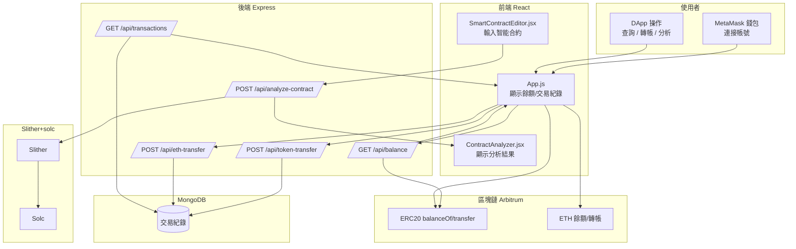

# FJCU Token DApp

一個基於 **React + Express + MongoDB + ethers.js** 的全端 DApp 專案，  
實作了 **ERC-20 Token 餘額查詢 / 轉帳 / ETH 轉帳 / 交易紀錄** 功能，並整合 **Slither** 做智能合約安全檢測。  

---

## 功能特色

### 前端 (React)
- 使用 MetaMask 連接錢包
- 查詢 **ERC-20 代幣餘額** 與 **ETH 餘額**
- 發送 ERC-20 代幣與 ETH 轉帳
- 分頁顯示交易紀錄（含 Tx Hash 連結到 Arbiscan）
- 智能合約代碼輸入與安全檢測（呼叫後端 Slither）

### 後端 (Express + MongoDB)
- 連線到 **Arbitrum Sepolia (Infura)**，讀取 ERC-20 合約
- 提供 REST API：
  - `GET /api/balance/:address` → 查詢 ERC-20 餘額
  - `POST /api/token-transfer` → 保存 Token 轉帳紀錄
  - `POST /api/eth-transfer` → 保存 ETH 轉帳紀錄
  - `GET /api/transactions` → 查詢交易紀錄
  - `POST /api/analyze-contract` → 呼叫 Slither + solc 檢測智能合約
- 使用 MongoDB 儲存交易紀錄

---

## 專案架構
```text
.
├─ frontend/                          # React 前端
│  ├─ package.json
│  └─ src/
│     ├─ App.js                       # 主畫面與錢包連接、餘額、轉帳、分頁、分析觸發
│     ├─ FjcuToken.json               # ERC-20 ABI（前端用）
│     ├─ SmartContractEditor.jsx      # 智能合約編輯器（輸入 Solidity 原始碼）
│     ├─ ContractAnalyzer.jsx         # 智能合約分析結果視圖
│     ├─ App.css
│     └─ index.js
│
├─ backend/                           # Express 後端
│  ├─ package.json
│  ├─ server.js                       # REST API（餘額 / 交易紀錄 / 合約分析）與鏈上連線
│  └─ FjcuToken.json                  # ERC-20 ABI（後端用）
│
└─ .env                               # 共享環境變數
```
---

## 主要依賴套件

### 前端 (frontend/package.json)
- react ^18.2.0
- react-dom ^18.2.0
- react-scripts 5.0.1
- ethers ^5.7.2
- axios ^1.4.0
- lodash ^4.17.21
- solc ^0.8.28
- web-vitals ^4.2.3

### 後端 (backend/package.json)
- express ^4.18.2
- mongoose ^7.8.2
- ethers ^5.7.2
- cors ^2.8.5
- dotenv ^16.0.3
- @openzeppelin/contracts ^5.0.0
- devDependencies: nodemon ^2.0.22

---

## 環境需求

- Node.js 18+
- MongoDB (本地或雲端，如 MongoDB Atlas)
- Infura 帳號 (Arbitrum Sepolia)
- Python 3.12 + Slither
- Solidity 編譯器 (solc)

---

## 環境變數設定

建立 `.env` 檔案：
```
MONGODB_URI=mongodb://localhost:27017/fjcu_dapp
INFURA_PROJECT_ID=your_infura_project_id
PRIVATE_KEY=0x你的私鑰
CONTRACT_ADDRESS=0xYourContractAddress
PORT=5000
CORS_ORIGINS=http://localhost:3000
```
前端若是 Create React App，需要額外在 `.env` 加上：
```
REACT_APP_CONTRACT_ADDRESS=0xYourContractAddress
REACT_APP_BACKEND_URL=http://localhost:5000
```
---

## 安裝與啟動

### 1. Clone 專案
```
git clone https://github.com/yourname/BlockChain.git
cd fjcu-token-dapp
```
### 2. 安裝後端
```
cd backend
npm install
```
### 3. 安裝前端
```
cd ../frontend
npm install
```
### 4. 啟動後端
```
cd ../backend
npm run dev   # 或 npm start
```
後端預設運行在 http://localhost:5000

### 5. 啟動前端
```
cd ../frontend
npm start
```
前端預設運行在 http://localhost:3000

---

## API 範例

### 查詢 ERC20 餘額
```h.abcd
Response:
{ "balance": "1000.0" }
```
### 提交代幣轉帳紀錄
```
POST /api/token-transfer
Content-Type: application/json
{
  "from": "0xSender",
  "to": "0xRecipient",
  "amount": "100",
  "txHash": "0xabc123..."
}
```
### 智能合約檢測
```
POST /api/analyze-contract
Content-Type: application/json
{
  "code": "pragma solidity ^0.8.0; contract Test { ... }"
}
Response:
{
  "safe": false,
  "vulnerabilities": ["reentrancy", "tx.origin"],
  "errors": []
}
```
## 系統流程圖


